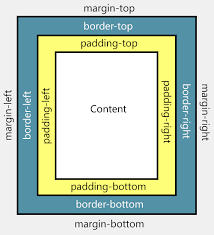

# <span style="color: #FC8642; font-weight: bold;">HTML/CSS Learning</span>
Repositorio enfocado a almacenar el conocimiento adquirido durante diversos cursos de HTML y CSS.
# <span style="color: #FC8642; font-weight: bold;">Índice</span>
- [HTML/CSS Learning](#htmlcss-learning)
- [Índice](#índice)
- [Útiles](#útiles)
- [Historia HTML](#historia-html)
- [Historia CSS](#historia-css)
- [Motores de navegadores](#motores-de-navegadores)
  - [Google Chrome: Blink](#google-chrome-blink)
  - [Microsoft Edge: EdgeHtml](#microsoft-edge-edgehtml)
  - [Safari: Webkit](#safari-webkit)
  - [Firefox: Gecko](#firefox-gecko)
- [Proceso de un motor de renderizado](#proceso-de-un-motor-de-renderizado)
- [Aspectos Técnicos](#aspectos-técnicos)
  - [DOM](#dom)
  - [CSSDOM](#cssdom)
- [Sobre HTML](#sobre-html)
  - [Etiquetas](#etiquetas)
    - [Básicos](#básicos)
    - [Layout](#layout)
    - [Textos](#textos)
    - [Formulario](#formulario)
    - [Enlaces](#enlaces)
    - [Imágenes y video](#imágenes-y-video)
    - [Listas](#listas)
    - [Tablas](#tablas)
- [Sobre CSS](#sobre-css)
  - [Selectores](#selectores)
    - [Selectores de elemento](#selectores-de-elemento)
    - [Selectores de clase](#selectores-de-clase)
    - [Selectores de ID](#selectores-de-id)
    - [Selectores de atributo](#selectores-de-atributo)
    - [Selectores de hijo](#selectores-de-hijo)
    - [Selectores de hermano](#selectores-de-hermano)
    - [Selectores de precedencia](#selectores-de-precedencia)
    - [Selectores de pseudoclases](#selectores-de-pseudoclases)
    - [Selectores de pseudoelementos](#selectores-de-pseudoelementos)
  - [Cascada](#cascada)
  - [Especificidad](#especificidad)
  - [Display: Tipos](#display-tipos)
  - [Diferencias entre margin y padding](#diferencias-entre-margin-y-padding)
  - [Positions](#positions)
  - [Medidas](#medidas)
    - [Medias absolutas](#medias-absolutas)
    - [Medias relativas](#medias-relativas)
  - [Arquitecturas CSS](#arquitecturas-css)
    - [Objetivos de las arquitecturas de CSS](#objetivos-de-las-arquitecturas-de-css)
    - [Buenas prácticas de las arquitecturas de CSS](#buenas-prácticas-de-las-arquitecturas-de-css)
    - [Arquitectura OOCSS (Object Oriented CSS)](#arquitectura-oocss-object-oriented-css)
    - [Arquitectura BEM (Block-Element-Modifier)](#arquitectura-bem-block-element-modifier)
    - [Arquitectura SMACSS (Scalable and Modular Architecture for CSS)](#arquitectura-smacss-scalable-and-modular-architecture-for-css)
    - [Arquitectura ITCSS (Inverted Triangle CSS)](#arquitectura-itcss-inverted-triangle-css)
    - [Arquitectura Atomic Design](#arquitectura-atomic-design)
# <span style="color: #FC8642; font-weight: bold;">Útiles</span>
- Generador de Favicon: [Link](https://favicon.io/favicon-converter/).
- Documentación etiquetas HTML y más: [Link](https://htmlreference.io/).
- Guías de CSS y más: [Link](https://css-tricks.com/guides/).

[Volver al Índice 🔝](#índice)
# <span style="color: #FC8642; font-weight: bold;">Historia HTML</span>
HTML (Hypertext Markup Language) es un lenguaje de marcado utilizado para estructurar y dar formato a contenido en la World Wide Web. HTML fue creado en el año 1990 por el físico y matemático británico Tim Berners-Lee, mientras trabajaba en el Centro Europeo de Investigación Nuclear (CERN).

Berners-Lee utilizó HTML para crear un sistema de hipertexto que permitiera a los científicos compartir documentos e información de manera sencilla a través de internet. Originalmente, HTML consistía en un conjunto muy pequeño de etiquetas, pero ha ido evolucionando a lo largo de los años para incluir una amplia variedad de elementos y atributos que permiten crear contenido más sofisticado y mejorar la experiencia del usuario.

Hoy en día, HTML es uno de los lenguajes más importantes y ampliamente utilizados en la World Wide Web y es esencial para la creación de páginas web y aplicaciones web. La última versión de HTML es HTML5, que fue publicada en octubre de 2014.

[Volver al Índice 🔝](#índice)
# <span style="color: #FC8642; font-weight: bold;">Historia CSS</span>
CSS (Cascading Style Sheets) es un lenguaje de estilo utilizado para describir la presentación de documentos escritos en HTML y XML. CSS fue creado en el año 1996 por el World Wide Web Consortium (W3C), una organización internacional que establece estándares para la World Wide Web.

El principal objetivo de CSS era separar la información de contenido de la información de presentación en las páginas web. Antes de CSS, la información de presentación se mezclaba con la información de contenido en las páginas web utilizando atributos de estilo en las etiquetas HTML. Esto hacía que las páginas web fueran difíciles de mantener y modificar y no permitía una gran flexibilidad en la presentación del contenido.

Con CSS, los diseñadores pueden crear estilos centralizados que se aplican a varias páginas web, lo que permite una mayor flexibilidad y facilita el mantenimiento de las páginas web. Actualmente, hay varias versiones de CSS disponibles, incluyendo CSS2 y CSS3. La última versión de CSS es CSS3, que fue publicada en diciembre de 2017.

[Volver al Índice 🔝](#índice)
# <span style="color: #FC8642; font-weight: bold;">Motores de navegadores</span>
## <span style="color: #D67238; font-weight: bold;">Google Chrome: Blink</span>
Blink es el motor de renderizado utilizado por Google Chrome y otros navegadores basados en Chromium. El motor de renderizado es el software encargado de interpretar el código HTML, CSS y JavaScript de una página web y de dibujar el contenido en la pantalla del usuario.

Blink fue creado en 2013 por Google como una bifurcación de WebKit, el motor de renderizado originalmente utilizado por Chrome. La principal razón de la creación de Blink fue permitir a Google tener mayor control y flexibilidad en el desarrollo del motor de renderizado y poder implementar cambios y mejoras más rápidamente.

Blink utiliza el lenguaje de programación C++ y está diseñado para ser rápido, eficiente y compatible con los estándares web. Además, Blink incluye una serie de características avanzadas como soporte para gráficos en 3D y la capacidad de reproducir audio y vídeo de alta calidad.

[Volver al Índice 🔝](#índice)
## <span style="color: #D67238; font-weight: bold;">Microsoft Edge: EdgeHtml</span>
EdgeHTML fue creado por Microsoft como una bifurcación de Trident, el motor de renderizado originalmente utilizado por Internet Explorer. La principal razón de la creación de EdgeHTML fue permitir a Microsoft tener mayor control y flexibilidad en el desarrollo del motor de renderizado y poder implementar cambios y mejoras más rápidamente.

EdgeHTML utiliza el lenguaje de programación C++ y está diseñado para ser rápido, eficiente y compatible con los estándares web. Además, EdgeHTML incluye una serie de características avanzadas como soporte para gráficos en 3D y la capacidad de reproducir audio y vídeo de alta calidad.

EdgeHTML es plenamente compatible con los motores de diseño de Blink y Webkit, utilizados por Google Chrome y Safari, respectivamente. Microsoft ha declarado que "cualquier diferencia de Blink-WebKit son bugs que estamos interesados de solucionar."

[Volver al Índice 🔝](#índice)
## <span style="color: #D67238; font-weight: bold;">Safari: Webkit</span>
WebKit es el motor de renderizado utilizado por Safari, el navegador web de Apple, y por otros navegadores como Google Chrome y Opera.

WebKit fue creado en el año 1998 por la empresa de software Trolltech como un motor de renderizado para aplicaciones gráficas. En el año 2005, Apple utilizó WebKit como base para el desarrollo de Safari y lo hizo un proyecto de código abierto. Desde entonces, WebKit ha sido utilizado por varios navegadores web y ha evolucionado para incluir una amplia variedad de características y mejoras.

WebKit utiliza el lenguaje de programación C++ y está diseñado para ser rápido, eficiente y compatible con los estándares web. Además, WebKit incluye una serie de características avanzadas como soporte para gráficos en 3D y la capacidad de reproducir audio y vídeo de alta calidad.

[Volver al Índice 🔝](#índice)
## <span style="color: #D67238; font-weight: bold;">Firefox: Gecko</span>
Gecko fue creado por Netscape en el año 1998. El objetivo principal de Gecko era proporcionar un motor de renderizado libre y de código abierto que pudiera utilizarse en cualquier aplicación o plataforma.

Gecko es un motor de renderizado libre escrito en C++. Actualmente su desarrollo es gestionado por la Fundación Mozilla y la Corporación Mozilla.

Gecko es una plataforma para aplicaciones multiplataforma, es decir: permite ejecutar aplicaciones sobre su motor que se sirvan de tecnologías como XUL, XBL, PNG, HTTP, POP3, SMTP, RDS, CSS virtualmente en cualquier sistema operativo.

Anteriormente Gecko fue conocido con los nombres Raptor y NGLayout.

Gecko utiliza el lenguaje de programación C++.

[Volver al Índice 🔝](#índice)
# <span style="color: #FC8642; font-weight: bold;">Proceso de un motor de renderizado</span>
1) El navegador recibe una solicitud del usuario para cargar una página web.
2) El navegador envía una solicitud de red al servidor web para obtener el contenido de la página.
3) El servidor web envía una respuesta al navegador con el contenido de la página, que normalmente incluye código HTML, CSS y JavaScript.
4) El motor de renderizado del navegador comienza a interpretar el código HTML para comprender la estructura del contenido de la página.
5) Mientras interpreta el código HTML, el motor de renderizado también descarga los archivos CSS y JavaScript necesarios para dar formato y añadir interactividad a la página.
6) Una vez que ha descargado y parseado todos los archivos necesarios, el motor de renderizado comienza a construir el árbol de renderizado de la página. El árbol de renderizado es una representación.

Otra forma de describir estos pasos, y de manema mas tecnica, seria:
1) Transforma los archivos a un árbol de objetos HTML o CSS, estos se denominan DOM (Document Object Model) y CSSDOM (Cascade Style Sheet Object Model), respectivamente. Cada nodo en el árbol es una representación de los elementos que contiene el archivo HTML o CSS.
2) Calcula el estilo correspondiente a cada nodo del DOM relacionado al CSSDOM.
3) Calcula las dimensiones de cada nodo y dónde va en la pantalla.
4) Pinta o renderiza los diferentes elementos como cajas o contenedores.
5) Agrupa todas las cajas en diferentes capas para convertirlas en una imagen que se renderiza en pantalla.

[Volver al Índice 🔝](#índice)
# <span style="color: #FC8642; font-weight: bold;">Aspectos Técnicos</span>
## <span style="color: #D67238; font-weight: bold;">DOM</span>
El DOM (Modelo de Objeto del Documento) es una interface de programación de aplicaciones (API) para documentos HTML y XML. El DOM proporciona una representación estructurada del contenido de una página web como un árbol de objetos, con cada elemento HTML o XML convirtiéndose en un nodo del árbol. Esto permite a los programas acceder y manipular el contenido y el formato de una página web de manera dinámica.

Por ejemplo, si quieres cambiar el contenido de un elemento HTML, puedes utilizar el DOM para acceder al elemento y modificar su contenido. Del mismo modo, si quieres cambiar el estilo de un elemento, puedes utilizar el DOM para acceder al elemento y modificar sus propiedades de estilo.

El DOM es un estándar de la World Wide Web Consortium (W3C) y es ampliamente utilizado en la creación de aplicaciones web y en la implementación de funcionalidades avanzadas en las páginas web.

[Volver al Índice 🔝](#índice)
## <span style="color: #D67238; font-weight: bold;">CSSDOM</span>
El CSSDOM (Modelo de Objeto de Hoja de Estilo en Cascada) es una parte del DOM (Modelo de Objeto del Documento) que se encarga de gestionar y manipular el estilo de los elementos de una página web. El CSSDOM permite a los programas acceder y modificar las propiedades de estilo de los elementos HTML o XML de una página web de manera dinámica.

Por ejemplo, si quieres cambiar el color de fondo de un elemento HTML, puedes utilizar el CSSDOM para acceder al elemento y modificar su propiedad de estilo "background-color". Del mismo modo, si quieres cambiar el tipo de letra de un elemento, puedes utilizar el CSSDOM para acceder al elemento y modificar su propiedad de estilo "font-family".

El CSSDOM es una parte importante del DOM y es ampliamente utilizado en la creación de aplicaciones web y en la implementación de funcionalidades avanzadas en las páginas web.

[Volver al Índice 🔝](#índice)
# <span style="color: #FC8642; font-weight: bold;">Sobre HTML</span>
## <span style="color: #D67238; font-weight: bold;">Etiquetas</span>
Para ver un mejor resumen de las etiquetas, visitar el siguiente [Link](https://htmlreference.io/).
### <span style="color: #B05D2E; font-weight: bold;">Básicos</span>
- html: Es la etiqueta principal de HTML y define el inicio y el final de un documento HTML.
- head: Contiene información meta sobre el documento, como el título y los enlaces a archivos CSS y JavaScript.
- title: Define el título de la página, que se muestra en la pestaña del navegador.
- body: Contiene el contenido visible de la página web.
- div: Es la etiqueta de división y se utiliza para dividir el contenido en secciones lógicas.
- main: Define el contenido principal de un documento.

[Volver al Índice 🔝](#índice)
### <span style="color: #B05D2E; font-weight: bold;">Layout</span>
- header: Define un encabezado para una sección o una página.
- nav: Define una sección de navegación.
- section: Define una sección temática en un documento.
- article: Define un artículo autónomo.
- aside: Define un contenido secundario relacionado con el contenido principal.
- footer: Define un pie de página para una sección o una página.

[Volver al Índice 🔝](#índice)
### <span style="color: #B05D2E; font-weight: bold;">Textos</span>
- h1-h6: Son etiquetas de encabezado que se utilizan para definir títulos y subtítulos.
- p: Es la etiqueta de párrafo y se utiliza para definir bloques de texto.
- span: Es la etiqueta de span y se utiliza para aplicar estilos a fragmentos de texto sin afectar a otros elementos.

[Volver al Índice 🔝](#índice)
### <span style="color: #B05D2E; font-weight: bold;">Formulario</span>
- form: Es la etiqueta de formulario y se utiliza para crear formularios para recoger datos del usuario.
- input: Es la etiqueta de entrada y se utiliza para crear distintos tipos de campos de entrada en un formulario, como campos de texto, botones, etc.
- label: Se utiliza para asociar una etiqueta o una descripción con un elemento de formulario.
- button: Se utiliza para crear botones en una página web. Los botones pueden utilizarse para realizar distintas acciones, como enviar formularios, resetear formularios, enlazar a otras páginas, etc.

[Volver al Índice 🔝](#índice)
### <span style="color: #B05D2E; font-weight: bold;">Enlaces</span>
- a: Es la etiqueta de enlace y se utiliza para crear enlaces a otras páginas o a recursos externos.

[Volver al Índice 🔝](#índice)
### <span style="color: #B05D2E; font-weight: bold;">Imágenes y video</span>
- img: Es la etiqueta de imagen y se utiliza para insertar imágenes en la página.
- figure: Define contenido autónomo, como imágenes o diagramas, junto con una leyenda.
- svg: es una etiqueta de HTML que se utiliza para insertar gráficos vectoriales en una página web. SVG (Scalable Vector Graphics) es un lenguaje de marcado para gráficos vectoriales en línea.
- iframe: Es una etiqueta de HTML que se utiliza para insertar una página web dentro de otra página web. El contenido de la página se muestra en un marco o frame dentro de la página principal.
- video: Es una etiqueta de HTML que se utiliza para insertar vídeos en una página web.

[Volver al Índice 🔝](#índice)
### <span style="color: #B05D2E; font-weight: bold;">Listas</span>
- li: Se utiliza para definir un elemento de lista en una lista ordenada o desordenada.
- ul: Define una lista desordenada.
- ol: se utiliza para definir una lista ordenada en una página web.

[Volver al Índice 🔝](#índice)
### <span style="color: #B05D2E; font-weight: bold;">Tablas</span>
- table: Define una tabla.
- tr: Define una fila en una tabla.
- td: Define una celda en una tabla.
- th: Define una celda de encabezado en una tabla.

[Volver al Índice 🔝](#índice)
# <span style="color: #FC8642; font-weight: bold;">Sobre CSS</span>
Para busqueda de colores y sus códigos, visitar el siguiente [Link](https://htmlcolorcodes.com/es/).
## <span style="color: #D67238; font-weight: bold;">Selectores</span>
Los selectores de CSS son herramientas que se utilizan para seleccionar elementos de una página web y aplicarles estilos. Hay varios tipos de selectores en CSS, cada uno con distintas características y usos, a continuación, algunos de ellos.

[Volver al Índice 🔝](#índice)
### <span style="color: #B05D2E; font-weight: bold;">Selectores de elemento</span>
Seleccionan elementos de HTML en función de su nombre de etiqueta. Por ejemplo, el selector p seleccionaría todos los elementos <p> de la página.
```css
p {
    color: black;
}
```
[Volver al Índice 🔝](#índice)
### <span style="color: #B05D2E; font-weight: bold;">Selectores de clase</span>
Seleccionan elementos de HTML en función de su atributo class. Por ejemplo, el selector .mi-clase seleccionaría todos los elementos que tengan la clase mi-clase.
```css
.mi-clase {
    color: black;
}
```
[Volver al Índice 🔝](#índice)
### <span style="color: #B05D2E; font-weight: bold;">Selectores de ID</span>
Seleccionan elementos de HTML en función de su atributo id. Por ejemplo, el selector #mi-id seleccionaría el elemento con el id mi-id.
```css
#mi-id {
    color: black;
}
```
[Volver al Índice 🔝](#índice)
### <span style="color: #B05D2E; font-weight: bold;">Selectores de atributo</span>
Seleccionan elementos de HTML en función de un atributo específico y su valor. Por ejemplo, el selector "a[href='https://ejemplo.com']" seleccionaría todos los enlaces que apuntan a la URL https://ejemplo.com.
```css
a[href='https://ejemplo.com'] {
    color: black;
}
```
[Volver al Índice 🔝](#índice)
### <span style="color: #B05D2E; font-weight: bold;">Selectores de hijo</span>
 Seleccionan elementos que son hijos directos de otro elemento. Por ejemplo, el selector ul > li seleccionaría todos los elementos "li" que estén directamente dentro de un elemento "ul".
```css
ul > li {
    color: black;
}
```
 [Volver al Índice 🔝](#índice)
### <span style="color: #B05D2E; font-weight: bold;">Selectores de hermano</span>
Seleccionan elementos que tienen el mismo padre y están uno después del otro. Por ejemplo, el selector h1 + p seleccionaría todos los elementos "p" que vienen inmediatamente después de un elemento "h1".
```css
h1 + p {
    color: black;
}
```
[Volver al Índice 🔝](#índice)
### <span style="color: #B05D2E; font-weight: bold;">Selectores de precedencia</span>
Seleccionan elementos en función de la precedencia de sus selectores. Por ejemplo, el selector div p seleccionaría todos los elementos "p" que estén dentro de un elemento "div", mientras que el selector div > p sólo seleccionaría los elementos "p" que sean hijos directos de un elemento "div". Un espacio en blanco se utiliza para seleccionar todos los elementos con una clase específica dentro de un elemento con otra clase, independientemente de su nivel de anidamiento.
```css
/* Para seleccionar todos los elementos "p" que estén dentro de un elemento "div" */
div p { 
    color: black;
}

/* Para seleccionar los elementos "p" que sean hijos directos de un elemento "div" */
div > p { 
    color: black;
}
```
[Volver al Índice 🔝](#índice)
### <span style="color: #B05D2E; font-weight: bold;">Selectores de pseudoclases</span>
Los selectores de pseudoclases son un tipo especial de selectores en CSS que permiten seleccionar elementos en función de su estado o posición en la página. Los selectores de pseudoclases empiezan con dos puntos (:) y se utilizan para seleccionar elementos que no tienen un atributo específico, sino que tienen un estado determinado.

Algunos ejemplos de selectores de pseudoclases son:

- :hover: Selecciona elementos cuando el usuario pasa el cursor por encima de ellos.
- :active: Selecciona elementos cuando el usuario los está pulsando.
- :focus: Selecciona elementos cuando tienen el foco (por ejemplo, cuando se está escribiendo en un campo de texto).
- :first-child: Selecciona el primer hijo de un elemento.
- :last-child: Selecciona el último hijo de un elemento.
- :nth-child(n): Selecciona el n-ésimo hijo de un elemento.
```css
#button_send{
    color: black;
}

#button_send:hover{
    color: blue;
}
```
[Volver al Índice 🔝](#índice)
### <span style="color: #B05D2E; font-weight: bold;">Selectores de pseudoelementos</span>
Los selectores de pseudoelementos son un tipo especial de selectores en CSS que permiten seleccionar y dar estilos a partes específicas de un elemento. Los selectores de pseudoelementos empiezan con dos puntos y dos guiones bajos (::) y se utilizan para seleccionar elementos que no tienen un atributo específico, sino que representan una parte determinada de un elemento.

Algunos ejemplos de selectores de pseudoelementos son:

- ::before: Selecciona el contenido que se inserta antes de un elemento.
- ::after: Selecciona el contenido que se inserta después de un elemento.
- ::first-letter: Selecciona la primera letra de un elemento.
- ::first-line: Selecciona la primera línea de un elemento.
- ::selection: Selecciona el texto que el usuario ha seleccionado.

Por ejemplo, para añadir una flecha al final de todos los enlaces de una página, se puede utilizar el selector de pseudoelemento ::after de la siguiente manera:
```css
a::after {
  content: " ▶";
}
```
[Volver al Índice 🔝](#índice)
## <span style="color: #D67238; font-weight: bold;">Cascada</span>
 En CSS, las reglas se aplican a los elementos de un documento en cascada, lo que significa que un estilo definido en un elemento padre se propagará a sus elementos hijos. Esto permite una mayor flexibilidad y control en la presentación de un documento, ya que los estilos pueden ser aplicados a un solo elemento o a una jerarquía completa de elementos. Ademas, cuando se aplican varias reglas a un mismo elemento o clase, se utiliza el principio de cascada para determinar cuál de las reglas tiene prioridad. La cascada en CSS significa que las reglas se aplican de arriba hacia abajo y de izquierda a derecha en el documento.

[Volver al Índice 🔝](#índice)
## <span style="color: #D67238; font-weight: bold;">Especificidad</span>
La especificidad en CSS se refiere a la medida en la que una regla se aplica a un elemento específico en un documento. Cuanto más específica es una regla, más prioridad tendrá sobre otras reglas que se aplican al mismo elemento. La especificidad se mide utilizando un sistema de puntos de especificidad, donde cada tipo de selector tiene un valor asignado.

Existen cuatro tipos de selectores que contribuyen a la especificidad:

- Selectores de etiqueta (como "p" para párrafos): tienen un valor de 0,0,0,1.
- Selectores de clase (como ".myclass"): tienen un valor de 0,0,1,0.
- Selectores de atributo (como "[type='button']"): tienen un valor de 0,0,1,0.
- Selectores de ID (como "#myid"): tienen un valor de 0,1,0,0. 

Por ejemplo, si una regla tiene un selector de clase y un selector de ID, su especificidad sería 0,1,1,0. En caso de conflicto entre reglas, la regla con la especificidad más alta tendrá prioridad.

Es importante mencionar que las reglas inline (estilos directamente especificados en el HTML) tienen un valor de especificidad de 1,0,0,0 y siempre tienen prioridad sobre reglas especificadas en hojas de estilo.

[Volver al Índice 🔝](#índice)
## <span style="color: #D67238; font-weight: bold;">Display: Tipos</span>
En CSS, el atributo "display" es utilizado para especificar cómo se debe mostrar un elemento en una página web. Los valores más comunes para este atributo incluyen:

- "block": los elementos con este valor se muestran como bloques independientes, ocupando todo el ancho disponible y generando un salto de línea antes y después del elemento. Ejemplos incluyen elementos "div", "h1" y "p".
- "inline": los elementos con este valor se muestran en línea con el texto circundante, ocupando solo el espacio necesario y no generando salto de línea. Ejemplos incluyen elementos "span" y "a".
- "inline-block": los elementos con este valor se muestran en línea con el texto circundante, pero pueden tener dimensiones (como ancho y alto) y pueden ser afectados por las propiedades de posicionamiento de CSS.
- "none": los elementos con este valor no se muestran en absoluto, y no ocupan espacio en la página.
- "flex": elementos con este valor se comportan como un contenedor flex, permitiendo organizar los elementos hijos de manera flexible.
- "grid": elementos con este valor se comportan como un contenedor grid, permitiendo organizar los elementos hijos en una rejilla.

Existen otros valores menos comunes para el atributo "display" en CSS, pero estos son los más utilizados en la mayoría de los casos. El valor que se utiliza dependerá del efecto visual deseado y de cómo se desea que el elemento interactúe con los elementos circundantes.

[Volver al Índice 🔝](#índice)
## <span style="color: #D67238; font-weight: bold;">Diferencias entre margin y padding</span>
- Margin: Es el espacio vacío alrededor de un elemento. Puede ser especificado en píxeles o porcentajes. Los márgenes pueden ser establecidos en cualquier lado del elemento.
- Border: Es un borde alrededor de un elemento. Puede ser establecido en cualquier lado del elemento, y puede tener un ancho, un estilo y un color.
- Padding: Es el espacio vacío dentro de un elemento, entre el contenido y el borde Puede ser especificado en píxeles o porcentajes. Los márgenes pueden ser establecidos en cualquier lado del elemento.
- Content: Es el contenido dentro de un elemento. Puede ser texto, imágenes, videos, etc.



[Volver al Índice 🔝](#índice)
## <span style="color: #D67238; font-weight: bold;">Positions</span>
En CSS, la propiedad "position" se utiliza para establecer la posición de un elemento en relación a su elemento padre o al viewport (ventana de visualización). Existen cuatro valores posibles para esta propiedad:

- "static" (predeterminado): El elemento se posiciona de acuerdo con el flujo normal del documento.
- "relative": El elemento se posiciona en relación a su posición normal en el flujo del documento. Utilizando las propiedades "top", "bottom", "left" y "right" se puede mover el elemento en cualquiera de estas direcciones.
- "absolute": El elemento se posiciona en relación al primer elemento padre con posición "relative" o "absolute". Si no hay ningún elemento padre con estas posiciones, el elemento se posiciona en relación al viewport. Utilizando las propiedades "top", "bottom", "left" y "right" se puede mover el elemento en cualquiera de estas direcciones.
- "fixed": El elemento se posiciona en relación al viewport y se mantiene en su posición aunque la página se desplace. Utilizando las propiedades "top", "bottom", "left" y "right" se puede mover el elemento en cualquiera de estas direcciones.

Además, existe un valor más reciente, "sticky" el cual combina las características de "relative" y "fixed", el elemento se posiciona en relación a su posición normal en el flujo del documento hasta que alcanza un punto específico (definido mediante las propiedades "top" o "bottom") en el viewport, entonces se mantiene fijo en esa posición mientras el usuario sigue desplazando la página.

[Volver al Índice 🔝](#índice)
## <span style="color: #D67238; font-weight: bold;">Medidas</span>
### <span style="color: #B05D2E; font-weight: bold;">Medias absolutas</span>
En CSS existen varias medidas de longitud absolutas, las cuales son utilizadas para especificar el tamaño y posición de los elementos en una página web. Estas son:

- Píxeles (px): Es la medida absoluta más común en CSS. Un píxel es la unidad básica de medida en pantallas de visualización.
- Point (pt): Es una medida de impresión utilizada principalmente en diseño de impresión. Un punto equivale a 1/72 de pulgada.
- Inches (in): Es una medida de longitud utilizada principalmente en impresión. 1 pulgada = 96 pixeles.
- Centimeters (cm): Es una medida de longitud utilizada principalmente en impresión. 1 centímetro = 37.8 pixeles.
- Millimeters (mm): Es una medida de longitud utilizada principalmente en impresión. 1 milímetro = 3.78 pixeles.
- Picas (pc): Es una medida de impresión utilizada principalmente en diseño de impresión. Una pica equivale a 1/6 de pulgada.

Es importante tener en cuenta que estas medidas son absolutas y no se adaptan automáticamente al tamaño de la pantalla, por lo que se debe tener cuidado al utilizarlas, especialmente en diseño web adaptable (responsive design).

[Volver al Índice 🔝](#índice)
### <span style="color: #B05D2E; font-weight: bold;">Medias relativas</span>
En CSS existen varias medidas de longitud relativas, las cuales son utilizadas para especificar el tamaño y posición de los elementos en una página web de manera relativa a otro elemento o al tamaño de la pantalla. Estas son:

- Porcentaje ( %): Es una medida relativa al tamaño del elemento padre. Por ejemplo, si el ancho de un elemento padre es de 100px y el ancho de un elemento hijo es del 50%, entonces el ancho del elemento hijo sería de 50px.
- em: Es una medida relativa al tamaño de la letra del elemento. Por ejemplo, si el tamaño de la letra de un elemento es de 16px y el margen es de 1em, entonces el margen sería de 16px.
- rem: Es similar a em, pero se refiere al tamaño de la letra del elemento raíz (normalmente el elemento html) en lugar del elemento actual.
- vw: Es una medida relativa al ancho del viewport (ventana de visualización). 1vw equivale al 1% del ancho del viewport.
- vh: Es una medida relativa al alto del viewport (ventana de visualización). 1vh equivale al 1% del alto del viewport.
- vmin: Es una medida relativa al menor valor entre el ancho y el alto del viewport. 1vmin equivale al 1% del menor valor entre el ancho y el alto del viewport.
- vmax: Es una medida relativa al mayor valor entre el ancho y el alto del viewport. 1vmax equivale al 1% del mayor valor entre el ancho y el alto del viewport.

Al utilizar medidas relativas, los elementos se adaptan automáticamente al tamaño de la pantalla, lo que es útil para el diseño web adaptable (responsive design).
[Volver al Índice 🔝](#índice)
## <span style="color: #D67238; font-weight: bold;">Arquitecturas CSS</span>
Las arquitecturas CSS consisten en manejar el código CSS con una serie de reglas y patrones para facilitar su lectura, mantenibilidad y escabilidad.

El código que has manejado no se asemeja a la realidad, pues deberás manejar varios cientos o miles de líneas de código. Las arquitecturas CSS se encargan de manejar una norma en el código para que cualquiera pueda añadir o quitar funcionalidad sin mucho trabajo.

[Volver al Índice 🔝](#índice)
### <span style="color: #B05D2E; font-weight: bold;">Objetivos de las arquitecturas de CSS</span>
Los objetivos de las arquitecturas de CSS son:

- Ser predecible: el código debe ser lo menos complejo posible.
- Reutilizable: el código debe ser lo menos redundante, para evitar problemas con la especificidad.
- Mantenible: el código debe ser lo más fácil de manejar para añadir o quitar estilos.
- Escalable: el código debe ser capaz de crecer.

[Volver al Índice 🔝](#índice)
### <span style="color: #B05D2E; font-weight: bold;">Buenas prácticas de las arquitecturas de CSS</span>
Las buenas prácticas de las arquitecturas de CSS son:

- Lineamientos y estándares: definir normas en tu grupo de trabajo de cómo estará escrito el código.
- Documentación: establecer una breve explicación del código y de los lineamientos, esto sirve especialmente para nuevas personas se familiaricen con lo que deben hacer.
- Componentes: establecer de manera componetizada cada uno de los elementos de tu página, es decir, manejarlos por partes para después unirlos en un todo.

[Volver al Índice 🔝](#índice)
### <span style="color: #B05D2E; font-weight: bold;">Arquitectura OOCSS (Object Oriented CSS)</span>
OOCSS (Object Oriented CSS) es una técnica de diseño de hojas de estilo en cascada que se basa en la creación de objetos reutilizables y separación de estilos de contenido. Esto permite una mayor mantenibilidad, escalabilidad y velocidad en el desarrollo de proyectos web.

Un ejemplo de código OOCSS sería la creación de un objeto "botón" con estilos comunes como tamaño, tipografía y alineación, separados del estilo específico del contenido como color y texto del botón:
```css
/* Estilos comunes del objeto "botón" */
.btn {
    font-size: 16px;
    font-weight: bold;
    text-align: center;
    padding: 10px 20px;
    border-radius: 5px;
}

/* Estilos específicos del contenido */
.btn-primary {
    background-color: blue;
    color: white;
}

.btn-secondary {
    background-color: gray;
    color: white;
}
```
En este ejemplo, se crea un objeto "botón" con estilos comunes que se aplicarán a todos los botones en el sitio. Luego se crean clases específicas para botones primarios y secundarios, que tienen estilos específicos de contenido como el color de fondo y el color del texto. Esto permite una mayor flexibilidad y facilidad para cambiar estilos en todo el sitio, ya que solo se necesita actualizar el objeto "botón" en lugar de buscar y cambiar estilos específicos en varias partes del código.

En el siguiente ejemplo se utilizan las clases creadas en el ejemplo anterior para crear dos botones, uno primario y otro secundario:
```html
<button class="btn btn-primary">Enviar</button>
<button class="btn btn-secondary">Cancelar</button>
```
En este caso se esta asignando las clases "btn" y "btn-primary" al primer botón y las clases "btn" y "btn-secondary" al segundo botón. De esta manera se esta aplicando los estilos comunes del objeto "botón" y los estilos específicos del contenido según la clase asignada. El primer botón tendrá un estilo de fondo azul y el texto blanco y el segundo botón tendrá un estilo de fondo gris y el texto blanco.

[Volver al Índice 🔝](#índice)
### <span style="color: #B05D2E; font-weight: bold;">Arquitectura BEM (Block-Element-Modifier)</span>
BEM (Block-Element-Modifier) es una metodología de diseño de hojas de estilo en cascada que se centra en la organización y nombrado de clases para mejorar la claridad, la velocidad de desarrollo y la escalabilidad. BEM se basa en la idea de que todas las clases en un proyecto deben ser un bloque, un elemento o un modificador.

Un ejemplo de código CSS usando BEM sería la creación de un bloque "botón" con un elemento "icono" y un modificador "desactivado":
```css
/* Bloque "botón" */
.btn {
    font-size: 16px;
    padding: 10px 20px;
    border-radius: 5px;
}

/* Elemento "icono" dentro del bloque "botón" */
.btn__icon {
    width: 16px;
    height: 16px;
    margin-right: 10px;
}

/* Modificador "desactivado" para el bloque "botón" */
.btn--disabled {
    background-color: gray;
    color: #ccc;
    cursor: not-allowed;
}
```
En este ejemplo se esta creando un bloque "botón" con un elemento "icono" y un modificador "desactivado". El elemento "icono" es una parte del bloque "botón" y se usa para aplicar estilos al icono dentro del boton. El modificador "desactivado" es un estado o una versión especial del bloque "botón" y se usa para aplicar estilos cuando el boton esta desactivado.

Un ejemplo de código HTML que utilice estas clases sería:
```html
<button class="btn btn--disabled">
  <i class="btn__icon"></i>
  Enviar
</button>
```
En este caso se esta asignando la clase "btn" al botón, la clase "btn__icon" al icono y la clase "btn--disabled" al botón para aplicar estilos de desactivado. De esta manera se esta aplicando los estilos comunes del bloque "botón", los estilos específicos del elemento "icono" y los estilos específicos del modificador "desactivado" según las clases asignadas.

[Volver al Índice 🔝](#índice)
### <span style="color: #B05D2E; font-weight: bold;">Arquitectura SMACSS (Scalable and Modular Architecture for CSS)</span>
SMACSS (Scalable and Modular Architecture for CSS) es una metodología de diseño de hojas de estilo en cascada que se centra en la organización y estructuración de las hojas de estilo para mejorar la escalabilidad y la flexibilidad en proyectos web. SMACSS se divide en cinco categorías: Base, Layout, Module, State y Theme.

Un ejemplo de código CSS usando SMACSS sería la creación de un estilo base para el tipo de letra, un estilo de layout para la estructura de la página y un estilo de módulo para un botón:
```css
/* Estilo base para el tipo de letra */
body {
    font-family: Arial, sans-serif;
    font-size: 16px;
}

/* Estilo de layout para la estructura de la página */
#header, #footer, #main {
    width: 960px;
    margin: 0 auto;
}

/* Estilo de módulo para un botón */
.btn {
    background-color: blue;
    color: white;
    padding: 10px 20px;
    border-radius: 5px;
}
```
En este ejemplo se esta separando los estilos en diferentes categorías. Los estilos de base se refieren a los estilos comunes de la página, como el tipo de letra. Los estilos de layout se refieren a la estructura de la página, como la disposición de los elementos. Los estilos de módulos se refieren a los elementos individuales de la página, como un botón.

Un ejemplo de código HTML que utilice estas clases sería:
```html
<header id="header">
  <button class="btn">Enviar</button>
</header>
<main id="main">
  <p>Contenido principal</p>
</main>
<footer id="footer">
  <p>Pie de página</p>
</footer>
```
En este caso se esta asignando las clases "body" al cuerpo del HTML, las clases "header", "footer" y "main" para aplicar estilos de layout y la clase "btn" para aplicar estilos de módulo. De esta manera se esta aplicando los estilos comunes de base, estilos específicos de layout y estilos específicos de módulo según las clases asignadas.

[Volver al Índice 🔝](#índice)
### <span style="color: #B05D2E; font-weight: bold;">Arquitectura ITCSS (Inverted Triangle CSS)</span>
ITCSS (Inverted Triangle CSS) es una metodología de diseño de hojas de estilo en cascada que se centra en la organización y estructuración de las hojas de estilo para mejorar la escalabilidad, la claridad y la facilidad de mantenimiento en proyectos web. ITCSS se divide en varios niveles, cada uno con un propósito específico y una prioridad diferente.

Un ejemplo de código CSS usando ITCSS sería la creación de un estilo global para el tipo de letra, un estilo específico para un botón y un estilo para una clase personalizada:
```css
/* Estilo global para el tipo de letra */
html {
    font-family: Arial, sans-serif;
    font-size: 16px;
}

/* Estilo específico para un botón */
.btn {
    background-color: blue;
    color: white;
    padding: 10px 20px;
    border-radius: 5px;
}

/* Estilo para una clase personalizada */
.my-class {
    background-color: pink;
}
```
En este ejemplo se esta separando los estilos en diferentes niveles. El nivel global se refiere a los estilos comunes de la página, como el tipo de letra. El nivel específico se refieren a los elementos individuales de la página, como un botón. El nivel personalizado se refiere a las clases específicas que pueden ser utilizadas en diferentes partes de la página.

Un ejemplo de código HTML que utilice estas clases sería:
```html
<button class="btn my-class">Enviar</button>
```
En este caso se esta asignando las clases "btn" y "my-class" al botón para aplicar estilos de específico y personalizado. De esta manera se esta aplicando los estilos comunes globales, estilos específicos y estilos personalizados según las clases asignadas.

Es importante destacar que ITCSS es una metodología de organización de estilos que propone una estructura para facilitar la escalabilidad y el mantenimiento de los mismos, pero no es una técnica de diseño en sí misma, sino que se puede combinar con otras metodologías o patrones de diseño como BEM o OOCSS.

[Volver al Índice 🔝](#índice)
### <span style="color: #B05D2E; font-weight: bold;">Arquitectura Atomic Design</span>
Atomic Design es una metodología de diseño que se centra en la construcción de un sistema de diseño escalable y modular a través de la creación de elementos básicos y compuestos. El proceso de diseño se divide en cinco fases: Átomos, moléculas, organismos, plantillas y páginas.

Un ejemplo de código CSS usando Atomic Design sería la creación de un estilo para un átomo (botón) y un estilo para un organismo (formulario de contacto):
```css
/* Estilo para un átomo (botón) */
.btn {
    background-color: blue;
    color: white;
    padding: 10px 20px;
    border-radius: 5px;
}

/* Estilo para un organismo (formulario de contacto) */
.contact-form {
    width: 400px;
    background-color: #f9f9f9;
    padding: 20px;
    border-radius: 10px;
}

/* estilos para los elementos del formulario */
.contact-form label, 
.contact-form input,
.contact-form textarea {
    display: block;
    width: 100%;
    margin-bottom: 10px;
}
```
En este ejemplo se esta separando los estilos en diferentes niveles. El átomo sería un elemento básico como un botón, y el organismo es un conjunto de átomos que componen una estructura más compleja como un formulario de contacto.

Un ejemplo de código HTML que utilice estas clases sería:
```html
<form class="contact-form">
  <label for="name">Nombre</label>
  <input type="text" id="name" name="name">
  <label for="email">Email</label>
  <input type="email" id="email" name="email">
  <label for="message">Mensaje</label>
  <textarea id="message" name="message"></textarea>
  <button class="btn">Enviar</button>
</form>
```
En este caso se esta asignando la clase "contact-form" al formulario para aplicar estilos de organismo y la clase "btn" al botón para aplicar estilos de átomo. De esta manera se esta aplicando los estilos específicos de organismo y estilos específicos de átomo según las clases asignadas.

Al utilizar la metodología de Atomic Design se puede construir un sistema de diseño escalable y modular, donde se pueden reutilizar elementos básicos y compuestos en diferentes niveles y páginas del sitio web.

[Volver al Índice 🔝](#índice)


<!--
# <span style="color: #FC8642; font-weight: bold;">TITULO</span>
## <span style="color: #D67238; font-weight: bold;">TITULO</span>
### <span style="color: #B05D2E; font-weight: bold;">TITULO</span>
[Volver al Índice 🔝](#índice)
-->
